# SentinelOps — user guide

Every screenshot below was taken by driving the real application in a real
browser ([`docs/capture.py`](capture.py)). Nothing is a mock-up, so if the
interface changes and this guide is not re-captured, the difference will show.

> **The images are one slice behind.** The v3 migration renamed the AI verdict
> from *Finding* to *Assessment*, so some captions in the screenshots still read
> "Finding detail". The text below is current; the pictures are re-taken once the
> migration settles, with `python docs/capture.py`.

**Contents**

1. [Install and start](#1-install-and-start)
2. [What you are looking at](#2-what-you-are-looking-at)
3. [The guided walkthrough](#3-the-guided-walkthrough) — the six-minute tour
4. [The operator console](#4-the-operator-console)
5. [Uploading your own evidence](#5-uploading-your-own-evidence)
6. [The audit pack](#6-the-audit-pack)
7. [Starting over](#7-starting-over)
8. [Running it without the interface](#8-running-it-without-the-interface)
9. [When things look wrong](#9-when-things-look-wrong)

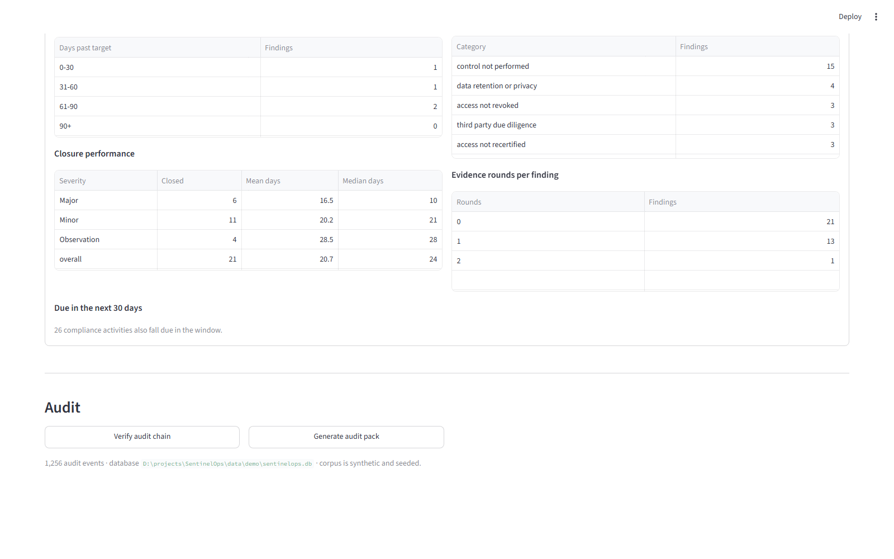

---

## 1. Install and start

Python 3.11 or newer.

```bash
pip install -e ".[dev,ui]"
streamlit run src/sentinelops/ui/app.py
```

The browser opens on `http://localhost:8501`. Nothing else needs a terminal
after this — the calendar, the cycles, uploads, re-assessment, the audit pack
and the integrity check are all buttons.

On first open the application seeds itself with a **synthetic organisation**:
seven business areas, fourteen compliance controls, and a year of evidence of
deliberately mixed quality. State lives in `data/demo/sentinelops.db` and
survives a page reload.

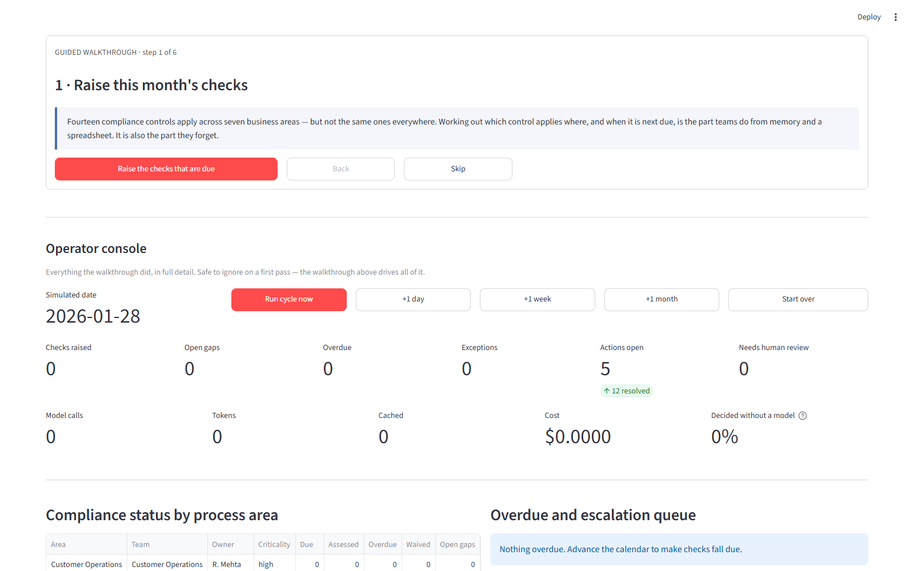

Nothing has run yet, so the counters are at zero. That is expected: press the
first walkthrough button.

---

## 2. What you are looking at

The page has two halves.

| | |
|---|---|
| **Guided walkthrough** (top) | Six steps, one button each. Explains the problem before you press, and what the numbers mean afterwards. Start here. |
| **Operator console** (below the divider) | Every panel in full detail. Safe to ignore on a first pass — the walkthrough drives all of it. |

The walkthrough tracks progress by looking at **the database, not a click
counter**, so reloading the page mid-demo picks up where the data actually is.

---

## 3. The guided walkthrough

### Step 1 — Raise this month's checks

Fourteen controls apply across seven areas, but not the same ones everywhere.
Deciding which control applies where is the part teams do from memory.

Press **Raise the checks that are due**.

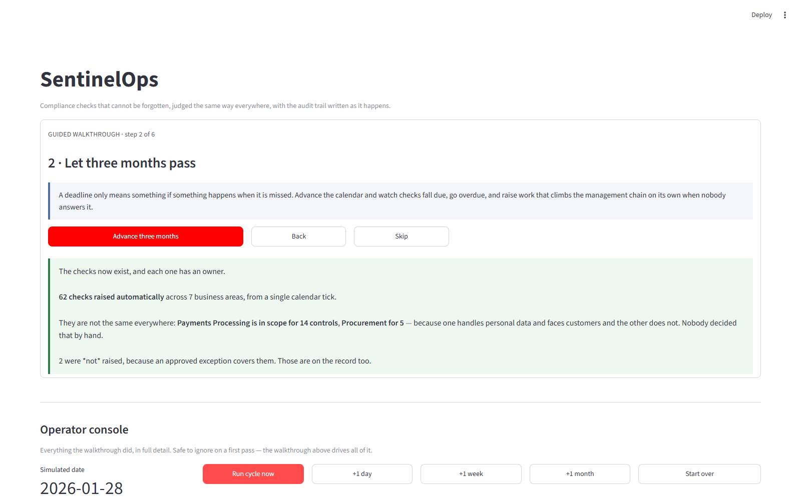

The point to notice is not the total — it is that the areas differ. Payments
Processing is in scope for fourteen controls and Financial Reporting for five,
because one handles personal data and faces customers and the other does not.
No one decided that by hand; it comes from each control's applicability rule
evaluated against each area's attributes.

Some checks are **not** raised at all, because an approved exception covers
them. Those are recorded too.

### Step 2 — Let three months pass

Press **Advance three months**. This runs three monthly cycles.

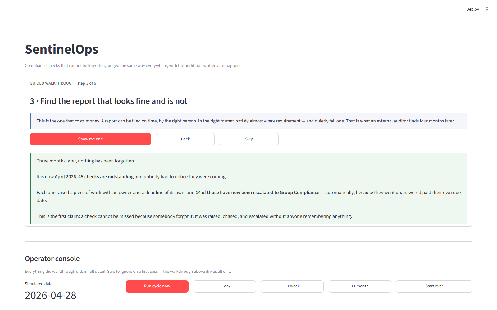

Checks fall due, go unanswered, and the findings raised from them are chased and
then escalated on a severity-driven timer. Nobody had to notice a deadline.

> **A note on escalation.** Two clocks run on every open finding: a reminder
> cadence and an escalation timer, both set by the severity the auditor
> assigned. A Major finding is escalated three days past its target date, an
> Observation seven — never more than a week in any case. Escalation goes up
> the owner's own reporting line *and* to PA/InfoSec, and the reminders keep
> going afterwards: escalating is not a way of handing the problem on.

### Step 3 — Find the report that looks fine and is not

Press **Show me one**.

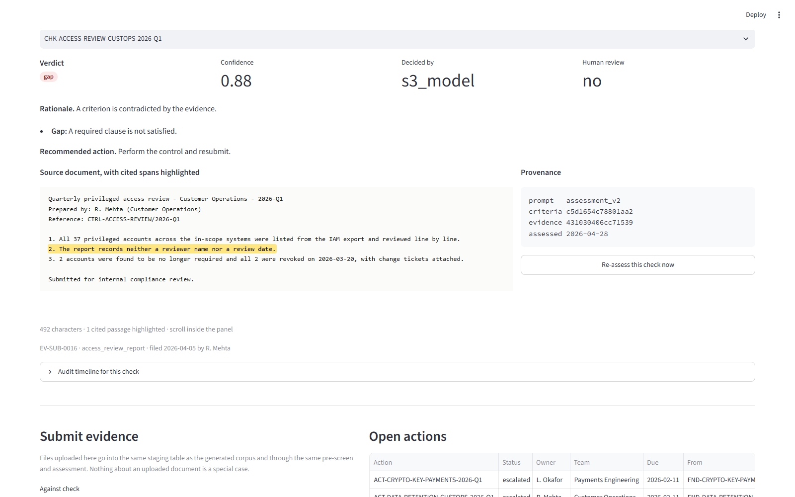

Then scroll down to **Assessment detail**. This is the view the whole system is
built around:

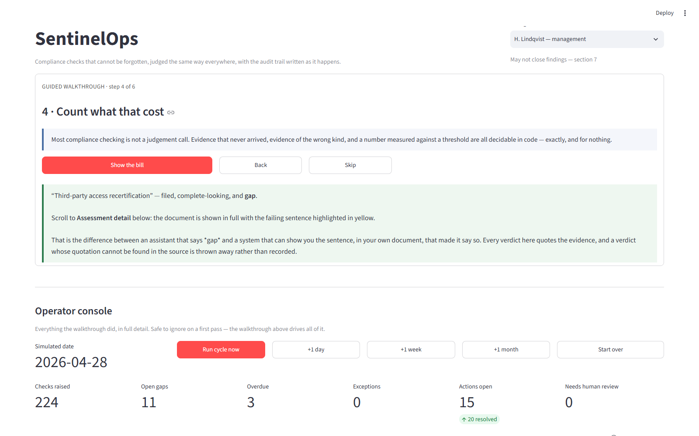

The report was filed on time, by the right person, in the right format, and
satisfies two of its three requirements. The **highlighted sentence is the one
that fails**. That is the difference between an assistant that says *gap* and a
system that can show you the sentence, in your own document, that made it say
so.

Three things on this panel are worth pointing at:

- **Decided by** — `s3_model` means a language model judged it. Rule-decided
  findings say so instead, and cost nothing.
- **Confidence** and **Human review** — a low-confidence verdict is routed to a
  person rather than asserted.
- **Provenance** — the prompt version, a hash of the criteria as they stood,
  and a hash of the evidence. Enough to reproduce the decision months later, or
  to show it was made against criteria that have since changed.

Every quoted span is checked back against the source. **A verdict whose
quotation cannot be found in the document is thrown away rather than
recorded** — so a citation you can see is a citation that resolved.

### Step 4 — Count what that cost

Press **Show the bill**.

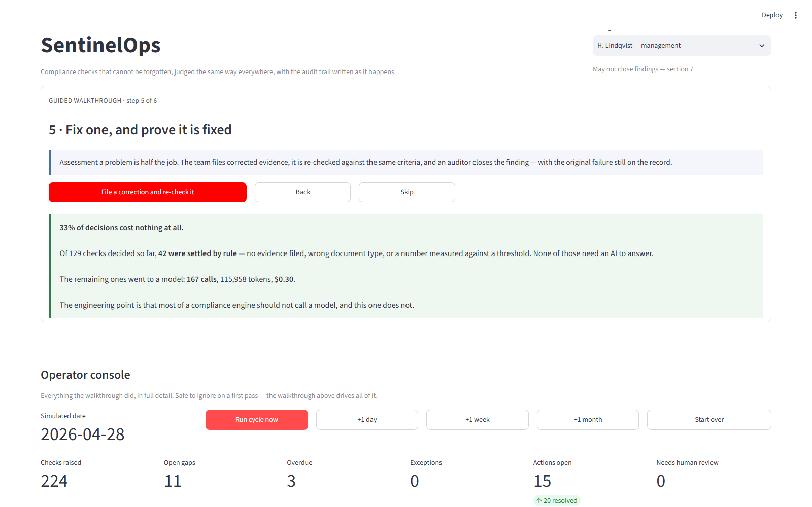

Roughly half of all decisions never reach a model: evidence that never arrived,
evidence of the wrong type, evidence too old to speak for its period, and
numbers measured against a threshold are all decidable in code — exactly, and
for nothing. Only ambiguous prose is worth paying for.

### Step 5 — Fix one, and prove it is fixed

Press **File a correction and re-check it**.

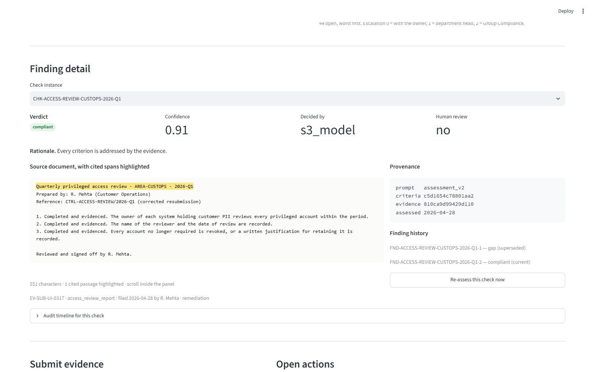

A corrected report is filed and goes through **the same** pre-screen and the
same assessment as the original — same criteria, same citation rule. If it
passes, an auditor closes the finding with remarks naming the assessment that
cleared it. If it does not, the finding **stays open** and the round is counted:
a finding is only ever closed by an auditor who is satisfied.

**Both assessments are kept.** The failure is marked superseded rather than
deleted, so the record still shows what was wrong and when. In *Assessment detail*
the **Assessment history** panel lists both.

### Step 6 — Prove none of this was edited afterwards

Press **Verify the record and build the pack**.


Every log entry carries the hash of the entry before it, so altering one line
breaks the chain at that point and at every point after. It cannot be edited
quietly. The auditor's pack is then rebuilt **from that log alone** — no
current-state table is read — and offered for download at the bottom of the
page.

---

## 4. The operator console

Everything the walkthrough did, in detail.

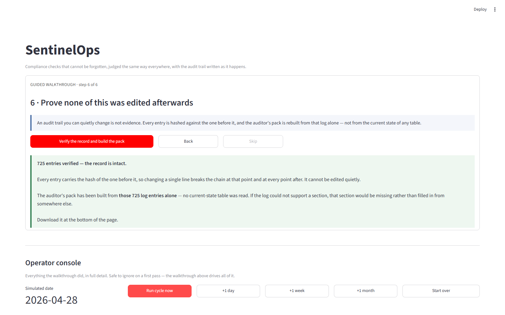

| Control | What it does |
|---|---|
| **Run cycle now** | One full pass at the current simulated date |
| **+1 day / +1 week / +1 month** | Advance the calendar and run the cycle that falls due |
| **Start over** | Delete the demo database and reseed |

The two metric rows are live. The second is the cost meter — watch it *not*
move when a check is decided by rule.

### Status and queues

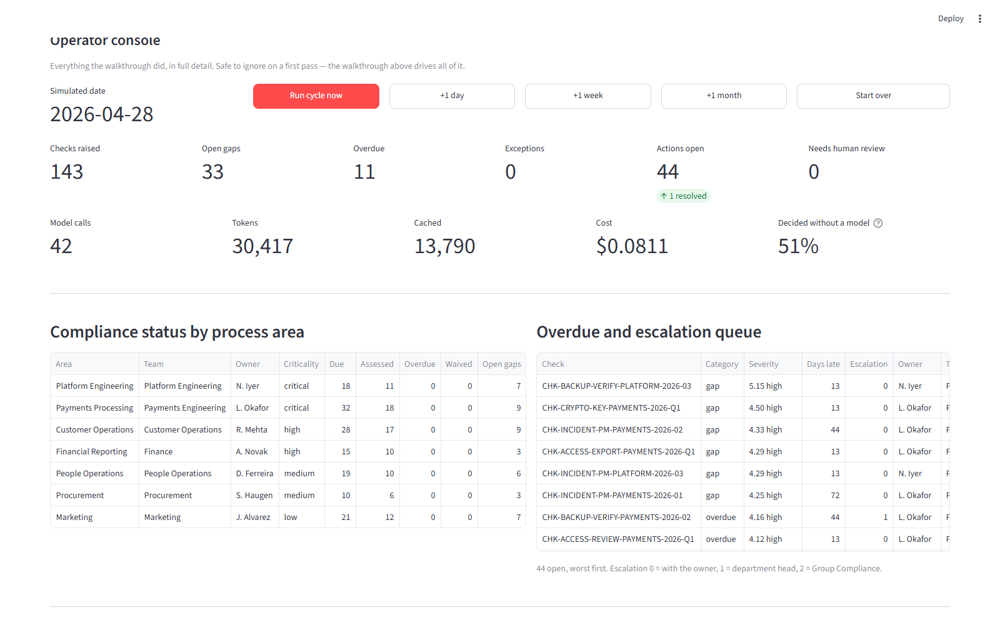

**Compliance status by process area** — worst first. *Worst severity* is a
documented formula: the control's own weight × how badly the verdict failed ×
how critical the area is × how long it has been outstanding. The arithmetic is
stored on every flag, so the number can be checked rather than trusted.

**Overdue and escalation queue** — what is late, worst first. *Escalation* 0
means it is with the owner, 1 a department head, 2 Group Compliance.

### Open findings

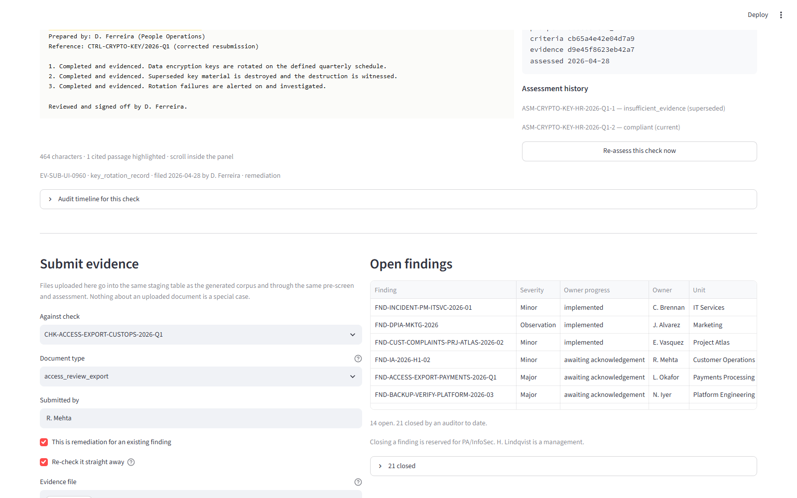

Every non-compliant assessment raises a **finding** against the owning unit. A
finding is Open or Closed and nothing else. Its target date is derived from the
severity — three days for an urgent Major, twenty-eight for an Observation —
and *Chased* counts how many times the owner has been reminded or sent back for
more evidence.

Owner progress (*acknowledged*, *action in progress*, *implemented*) is
self-reported and advisory: it never closes anything. Closed findings are listed
under the expander with the auditor who closed them and their remarks.

---

## 5. Uploading your own evidence

In **Submit evidence**:

1. **Against check** — pick the check the document answers.
2. **Document type** — the first entries are what this control accepts. Pick
   one of the others to watch the wrong-type rule reject it **without a model
   call**; the cost meter will not move.
3. **Submitted by** — whose name goes in the audit trail.
4. **This is remediation for an existing finding** — tick when fixing a failure.
5. **Re-check it straight away** — on by default, so one click files and judges.
6. Upload a file (`.txt`, `.md`, `.json`, `.csv`, `.log`) **or** paste text.
7. Press **Submit evidence**.

The confirmation names the record it created, its size, the verdict it reached
and whether the finding closed.

> Uploaded documents are not a special case. They land in the same table as the
> generated corpus and take the same path through the pre-screen and the
> assessment.

**Long documents.** Evidence can be a fifty-page export. The document panel is
a fixed-height frame with its own scrollbar, so the page never grows with the
document, and it opens scrolled to the first highlight. **Show more** makes the
panel taller — not the page longer.

---

## 6. The audit pack


- **Verify audit chain** — re-walks every entry and reports either the number
  verified or the sequence number of the first broken link.
- **Generate audit pack** — rebuilds the auditor's document and offers it as
  HTML or Markdown.

The pack contains a cover, a coverage summary, the exception register with
approvers and rationales, the findings register **with the cited excerpts
inline**, the finding register from raising to closure, a method note, and the
full chronological trail.

It is assembled from the audit log and nothing else. If the log could not
support a section, that section would be missing rather than quietly filled in
from elsewhere.

---

## 7. Starting over

**Start over** in the operator console deletes `data/demo/sentinelops.db` and
reseeds. The corpus is seeded and reproducible, so you get the identical
organisation, controls and evidence every time — the same demo, twice.

---

## 8. Running it without the interface

```bash
python -m sentinelops.synth               # regenerate the corpus and truth file
python -m evaluation                      # both pipelines, writes results.md
python -m sentinelops.demo.generate_pack  # the audit pack for the full year
python -m pytest                          # the test suite
python docs/capture.py                    # re-take the screenshots in this guide
```

---

## 9. When things look wrong

**The page is blank or the counters are zero.** Nothing has run yet. Press the
first walkthrough button.

**A button seems to do nothing.** It should always report back. If it does not,
the log is in the terminal running Streamlit.

**"No checks assessed yet".** Run step 1.

**The whole page reloads on every click.** That is Streamlit; it re-runs the
script on each interaction. State is in the database, so nothing is lost.

**The accuracy figures look too good.** They probably are. Unless a real
provider is configured, assessments come from `FakeModelClient`, a deterministic
keyword stub measured at ~91% agreement with the ground truth. For real
numbers:

```bash
echo "OPENAI_API_KEY=sk-..." > .env
SENTINELOPS_LLM_PROVIDER=openai streamlit run src/sentinelops/ui/app.py
```

`results.md` carries this caveat and several others in the file itself. They are
not decoration: the corpus is synthetic with constructed failure modes, and the
manual comparison it reports is a simulation whose assumptions are printed
alongside it.
